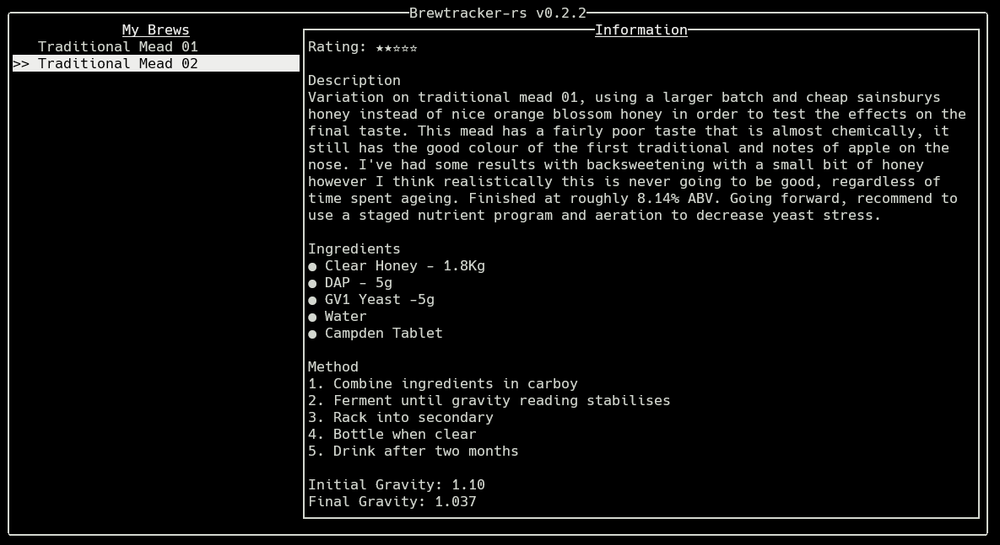

# Brewtracker-rs

A terminal app for tracking your homebrewing projects.

## Usage
Brewtracker is written in Rust and requires cargo to be installed to build. Clone the repo then run using `cargo run`

Use the arrow keys to select a brew
Page Up and Page Down to scroll the information panel